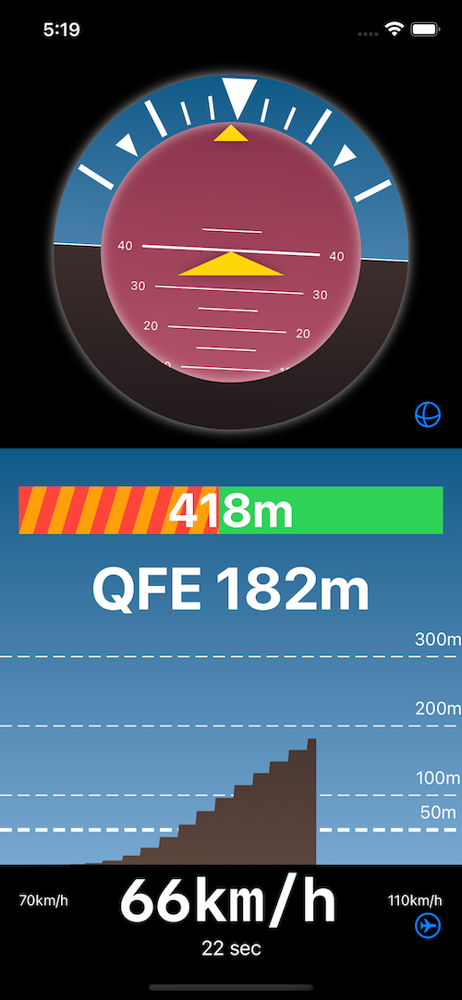

# Winch Launch Helper

This project comes from an old project I had done to display attitude and heading during flight as an experiment with SwiftUI. After some live tests, I noticed that the device suffered too much from the problem of drifting, making it less useful in practical use. However, having recently obtained the "Winch Launch" certification with the glider, I wondered if, during those brief seconds of launch, I could create a helper that would alert me in case of too pronounced errors (e.g., not respecting the minimum speed before transition or making too abrupt transitions). The project was born with the idea of evaluating whether it is possible to achieve something useful (and safe) while continuing to have fun with SwiftUI.

Current version

Features:

- The calculation of speed is done through integrated GPS with the accelerometer sensor (filtered with EKF); obviously, the data is only an estimate and does not correspond to the IAS; nevertheless, the ground speed indication during takeoff is read to increase awareness of what is happening.
- Automatic calculation of QFE through the barometer; on iOS, the reading is more accurate than that received through the GPS. The calculation considers the standard model of the atmosphere and is relatively precise when compared to an altimeter. Unfortunately, iOS provides the reading only once per second, and it is not possible to reproduce the effect of a variometer.
- Remaining runway distance "ahead"; this value is calculated in 2D from the current position. It is displayed as a green bar that fills up as you get close to the opposite runway threshold.
- Dumping of sensors to be able to execute the replay of the launch (currently requires recompiling the application).

Original screenshot

